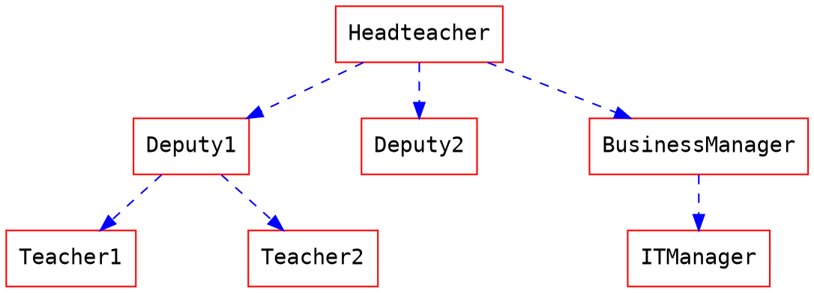
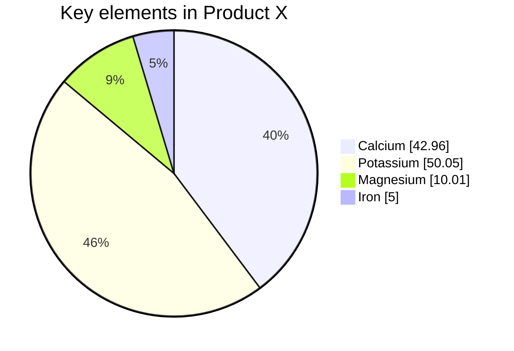

# hackmd-to-html-cli

[](https://www.npmjs.org/package/hackmd-to-html-cli)   

[toc]


## Title
### h3
#### h4
##### h5
###### h6


## Blockquote

> blockquoute
> > Hello
> 

## Text

~~del~~ *italic* **bold** ++inserted++ ==marked== H~2~O 1^st^ {超電磁砲|Railgun}

:accept: :smile: :+1: :aquarius: 

See repository on github: https://github.com/ksw2000/hackmd-to-html-cli/


## List

+ Eigensystems
    + Eigenvalue
    + Eigenvector
+ Inner-Product Vector Spaces

1. 高海千歌
2. 渡辺曜
3. 桜内梨子

## Check box

- [x] checked
- [ ] unchecked

## Table

| th | th | th  |
|:---|:---:|---:|
| left | center | right |
|xxxxxx|xxxxxx|xxxxxx|

## Container

:::success
Yes :tada:
:::

:::info
This is a message :mega:
:::

:::warning
Watch out :zap:
:::

:::danger
Oh No! :fire:
:::

:::spoiler Click to show details
You found me :stuck_out_tongue_winking_eye:
:::

:::spoiler {state="open"} Expand the spoiler container by default
You found me :stuck_out_tongue_winking_eye:
:::

## MathJax

A matrix $A$ is diagonalizable if there is a diagonal matrix $D$ and an invertible matrix $P$ s.t.
$$P^{-1}AP=D$$

For example:

$$
\begin{bmatrix}2&-1\\-1&1\end{bmatrix}\begin{bmatrix}6&-1\\2&3\end{bmatrix}\begin{bmatrix}1&1\\1&2\end{bmatrix}=\begin{bmatrix}5&0\\0&4\end{bmatrix}
$$

## Code

```c
#include<stdio.h>
int main(){
    printf("hello\n");
    return 0;
}
```

```go=
package main

import (
	"io"
	"log"
	"net/http"
)

func main() {
	http.HandleFunc("/", func(w http.ResponseWriter, req *http.Request) {
		io.WriteString(w, "Hello, TLS!\n")
	})

	// One can use generate_cert.go in crypto/tls to generate cert.pem and key.pem.
	log.Printf("About to listen on 8443. Go to https://127.0.0.1:8443/")
	err := http.ListenAndServeTLS(":8443", "cert.pem", "key.pem", nil)
	log.Fatal(err)
}
```

```
plaintext
```

## UML Diagrams

### Sequence Diagrams

```sequence
Alice->Bob: Hello Bob, how are you?
Note right of Bob: Bob thinks
Bob-->Alice: I am good thanks!
```

### Flow Charts

```flow
st=>start: Start:>http://www.google.com[blank]
e=>end:>http://www.google.com
op1=>operation: My Operation
sub1=>subroutine: My Subroutine
cond=>condition: Yes
or No?:>http://www.google.com
io=>inputoutput: catch something...
para=>parallel: parallel tasks

st->op1->cond
cond(yes)->io->e
cond(no)->para
para(path1, bottom)->sub1(right)->op1
para(path2, top)->op1
```

### Graphviz



### Mermaid




### Abc

```abc
X:1
T:Speed the Plough
M:4/4
C:Trad.
K:G
|:GABc dedB|dedB dedB|c2ec B2dB|c2A2 A2BA|
GABc dedB|dedB dedB|c2ec B2dB|A2F2 G4:|
|:g2gf gdBd|g2f2 e2d2|c2ec B2dB|c2A2 A2df|
g2gf g2Bd|g2f2 e2d2|c2ec B2dB|A2F2 G4:|
```

### Vega-Lite

```vega
{
  "$schema": "https://vega.github.io/schema/vega-lite/v4.json",
  "data": {"url": "https://vega.github.io/editor/data/barley.json"},
  "mark": "bar",
  "encoding": {
    "x": {"aggregate": "sum", "field": "yield", "type": "quantitative"},
    "y": {"field": "variety", "type": "nominal"},
    "color": {"field": "site", "type": "nominal"}
  }
}
```

> More information about **sequence diagrams** syntax [here](http://bramp.github.io/js-sequence-diagrams/).
> More information about **flow charts** syntax [here](http://adrai.github.io/flowchart.js/).
> More information about **graphviz** syntax [here](http://www.tonyballantyne.com/graphs.html)
> More information about **mermaid** syntax [here](http://mermaid-js.github.io/mermaid)
> More information about **abc** syntax [here](http://abcnotation.com/learn)
> More information about **vega** syntax [here](https://vega.github.io/vega-lite/docs)
> More information about **fretboard** syntax [here](https://hackmd.io/@docs/fretboard-syntax)

## YAML metadata

See: [https://hackmd.io/yaml-metadata](https://hackmd.io/yaml-metadata)

## Abbr

*[HTML]: Hyper Text Markup Language
*[W3C]:  World Wide Web Consortium

The HTML specification is maintained by the W3C.

## Footnote
Here is a footnote reference,[^1] and another.[^longnote]

[^1]: Here is the footnote.
[^longnote]: Here's one with multiple blocks.
    Subsequent paragraphs are indented to show that they
belong to the previous footnote.
