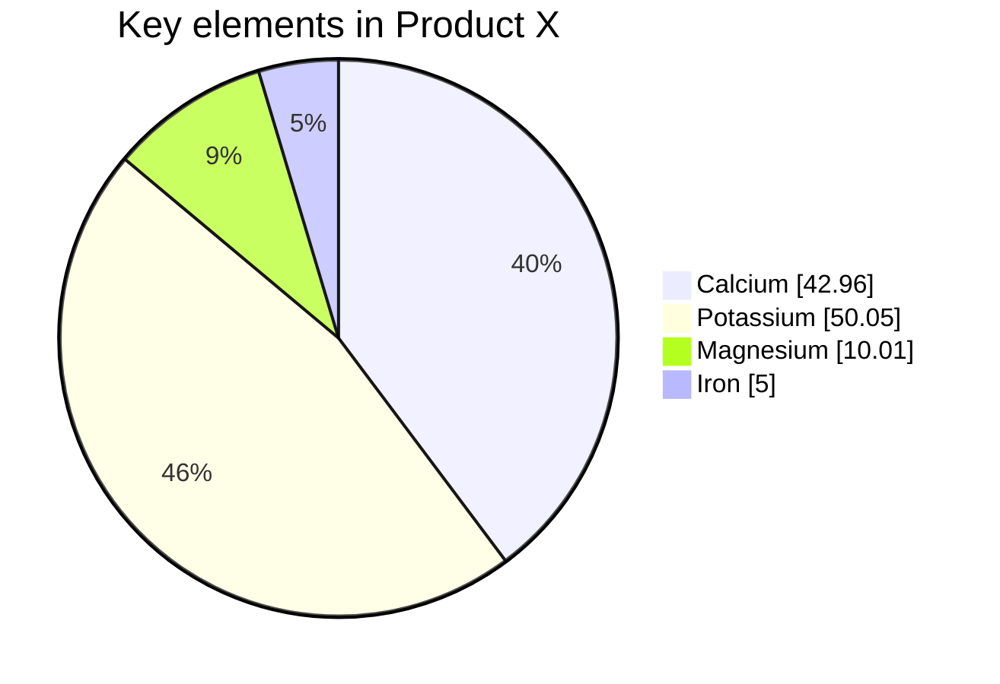

# hackmd-to-html-cli

[](https://www.npmjs.org/package/hackmd-to-html-cli)   

[toc]


## Title
### h3
#### h4
##### h5
###### h6


## Blockquote

> blockquoute
> > Hello
> 

## Text

~~del~~ *italic* **bold** ++inserted++ ==marked== H~2~O 1^st^ {超電磁砲|Railgun}

:accept: :smile: :+1: :aquarius: 

See repository on github: https://github.com/ksw2000/hackmd-to-html-cli/


## List

+ Eigensystems
    + Eigenvalue
    + Eigenvector
+ Inner-Product Vector Spaces

1. 高海千歌
2. 渡辺曜
3. 桜内梨子

## Check box

- [x] checked
- [ ] unchecked

## Table

| th | th | th  |
|:---|:---:|---:|
| left | center | right |
|xxxxxx|xxxxxx|xxxxxx|

## Container

:::success
success
:::

:::info
info
:::

:::warning
warning
:::

:::danger
danger
:::

## Math

A matrix $A$ is diagonalizable if there is a diagonal matrix $D$ and an invertible matrix $P$ s.t.
$$P^{-1}AP=D$$

For example:

$$
\begin{bmatrix}2&-1\\-1&1\end{bmatrix}\begin{bmatrix}6&-1\\2&3\end{bmatrix}\begin{bmatrix}1&1\\1&2\end{bmatrix}=\begin{bmatrix}5&0\\0&4\end{bmatrix}
$$

## Code

```c
#include<stdio.h>
int main(){
    printf("hello\n");
    return 0;
}
```

```go=
package main

import (
	"io"
	"log"
	"net/http"
)

func main() {
	http.HandleFunc("/", func(w http.ResponseWriter, req *http.Request) {
		io.WriteString(w, "Hello, TLS!\n")
	})

	// One can use generate_cert.go in crypto/tls to generate cert.pem and key.pem.
	log.Printf("About to listen on 8443. Go to https://127.0.0.1:8443/")
	err := http.ListenAndServeTLS(":8443", "cert.pem", "key.pem", nil)
	log.Fatal(err)
}
```

```
plaintext
```

## Mermaid



### Sequence

```sequence
Alice->Bob: Hello Bob, how are you?
Note right of Bob: Bob thinks
Bob-->Alice: I am good thanks!
```

### Flowchart

```flow
st=>start: Start:>http://www.google.com[blank]
e=>end:>http://www.google.com
op1=>operation: My Operation
sub1=>subroutine: My Subroutine
cond=>condition: Yes
or No?:>http://www.google.com
io=>inputoutput: catch something...
para=>parallel: parallel tasks

st->op1->cond
cond(yes)->io->e
cond(no)->para
para(path1, bottom)->sub1(right)->op1
para(path2, top)->op1
```

## Abbr

*[HTML]: Hyper Text Markup Language
*[W3C]:  World Wide Web Consortium

The HTML specification is maintained by the W3C.

## Footnote
Here is a footnote reference,[^1] and another.[^longnote]

[^1]: Here is the footnote.
[^longnote]: Here's one with multiple blocks.
    Subsequent paragraphs are indented to show that they
belong to the previous footnote.